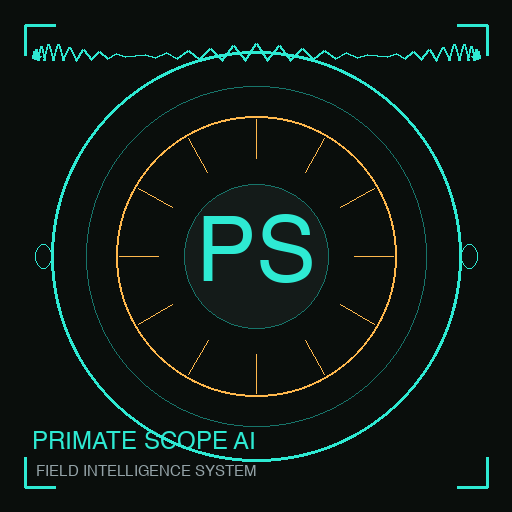

<p align="center">
  
</p>

<h1 align="center" style="font-family: 'Source Serif 4', Georgia, serif; color: #2EEAD3; margin-bottom: 4px;">
  PrimateScope AI
</h1>
<p align="center" style="color: #94A3B8; font-family: 'JetBrains Mono', monospace; font-size: 13px; letter-spacing: 0.08em; text-transform: uppercase; margin-top: 0;">
  Field Intelligence System — v1.0 Production
</p>

---

## Local-first camera-trap analysis with SpeciesNet + MegaDetector

PrimateScope AI is an offline research tool for primatologists and wildlife researchers. It processes real camera-trap images and short videos using Google's [SpeciesNet](https://github.com/google/cameratrapai) ensemble, persists results in SQLite, supports human review with audit logging, and exports clean research-ready CSV.

> **All processing is local. No cloud upload. No paid API. No telemetry. Your camera-trap footage stays yours.**

> **AI predictions are AI-assisted pre-labeling, NOT final scientific truth. A human reviewer is the final authority.**

---

## 2-Minute Setup

### macOS / Linux

```bash
cd dist
chmod +x SETUP.sh
./SETUP.sh
```

The script: checks Python → creates venv → installs dependencies → attempts SpeciesNet/MegaDetector install → downloads YOLOv8n (demo mode) → runs environment check.

### Windows

```
dist\SETUP.bat
```

### Launch

```bash
./LAUNCH.sh        # macOS/Linux
LAUNCH.bat         # Windows
```

The app opens at **http://localhost:8501**.

---

## Recommended Python Version

**Python 3.11 or 3.12.** Do NOT use Python 3.14 — SpeciesNet/MegaDetector may not install.

---

## Operating Modes

| Mode | Description |
|---|---|
| **Demo Simulation** (default) | YOLOv8n baseline + simulated data. Works without SpeciesNet. |
| **Real Inference** | SpeciesNet/MegaDetector on real uploads → SQLite persistence → review → CSV export. |

Switch modes in the sidebar. Real Inference shows engine status (SpeciesNet/MegaDetector availability).

---

## Production Workflow

1. **Create/select a project** (sidebar → Real Inference mode)
2. **Choose country code** for geographic filtering (ISO alpha-3: CHN, BGD, USA, etc.)
3. **Upload images/videos** on Live AI Analysis page
4. **Click "Run Real Analysis"** — app runs SpeciesNet, extracts video frames, parses results
5. **Review predictions** on Review Queue page — approve, correct, reject, mark uncertain
6. **Export reviewed CSV** on Research Insights & Export page

---

## Supported File Types

| Type | Extensions |
|---|---|
| Images | `.jpg`, `.jpeg`, `.png`, `.bmp`, `.tif`, `.tiff` |
| Videos | `.mp4`, `.mov`, `.avi`, `.mkv` |

Max file size: 500 MB. Videos: 20-30 second clips recommended (1 frame/second extraction by default).

---

## What is Real vs Simulated

| Component | Status |
|---|---|
| Local Streamlit app (offline) | Real |
| SpeciesNet/MegaDetector inference | Real (when installed) |
| Image & video upload processing | Real |
| SQLite persistence | Real |
| Human review queue + audit log | Real |
| CSV export of reviewed data | Real |
| Behavior intelligence (grooming/chasing/feeding) | Simulated — requires behavior model |
| Individual primate ID (M03/F07) | Simulated — requires re-identification model |
| Field station network map | Simulated — requires station metadata |
| Validation metrics (mAP, F1) | Planned — requires ground truth |

---

## Scientific Validation Required

Production v1 provides **AI-assisted pre-labeling**. Scientific use requires:

1. Expert-verified ground truth labels
2. Validation metrics (precision, recall, F1, mAP, per-species accuracy)
3. Review-time reduction measurement

See `docs/VALIDATION_PLAN.md` for the full validation framework.

---

## No Cloud Upload

- All processing happens on your local machine
- No files are uploaded to external services
- No paid APIs are called
- No telemetry is collected
- Human/person detections are flagged for privacy

---

## Pages

| # | Page | Description |
|---|---|---|
| 0 | Overview | Hero, pipeline, production status, real vs simulated |
| 1 | Research Dashboard | DB-backed stats (real mode) or simulated stats (demo) |
| 2 | Live AI Analysis | Demo scenarios + real inference upload |
| 3 | Review Queue | DB-backed review with filters, actions, audit log |
| 4 | Behavior Intelligence | Simulated timelines (labeled) |
| 5 | Field Stations | Simulated network (labeled) |
| 6 | Individual Profiles | Simulated profiles (labeled) |
| 7 | Research Insights & Export | Real CSV export + stats |

---

## Troubleshooting

| Problem | Solution |
|---|---|
| Python 3.14 detected | Install Python 3.11 or 3.12, recreate venv |
| SpeciesNet not installed | `pip install speciesnet --use-pep517` |
| MegaDetector not installed | `pip install megadetector` |
| App shows "MISSING" for engines | Run `python scripts/check_environment.py` |
| Inference fails | Check stderr in the expandable section on Live AI Analysis |
| Port 8501 in use | Edit LAUNCH.sh, change `--server.port` |

---

## Running Tests

```bash
source venv/bin/activate
python -m pytest tests/ -v
```

23 unit tests cover: safe filename, project creation, media insert, result parser (blank/animal/human/vehicle/multi/failure), review status update + audit, export CSV columns, video frame extraction, clip aggregation.

---

## Project Structure

```
dist/
├── app.py                    ← Streamlit entrypoint (Obsidian Canopy preserved)
├── production_ui.py          ← Real Inference mode page renderers
├── requirements.txt
├── SETUP.sh / SETUP.bat
├── LAUNCH.sh / LAUNCH.bat
├── database/                 ← SQLite persistence (db, models, repositories)
├── services/                 ← SpeciesNet, video, parser, export, storage, bbox
├── utils/                    ← Constants, validation, logging
├── tests/                    ← pytest unit tests
├── scripts/                  ← check_environment, create_sample_project, reset_db
├── docs/                     ← Production, SpeciesNet, Validation docs
├── sample_data/              ← Test fixtures
└── assets/                   ← Logo, screenshots
```

---

## Design System

**Obsidian Canopy** — deep forest charcoal + bioluminescent teal:

| Element | Color |
|---|---|
| Background | `#0A0F0D` |
| Cards | `#141C19` |
| Accent | `#0adec8` (teal) |
| Caution | `#FFB84D` (amber) |
| Text | `#94A3B8` (slate) |

Typography: Source Serif 4 · Geist · JetBrains Mono

---

## License

This software is provided for academic research and demonstration purposes only.

© 2026 PrimateScope AI. All rights reserved.

---

*Built with Streamlit · SpeciesNet · MegaDetector · SQLite · OpenCV*
